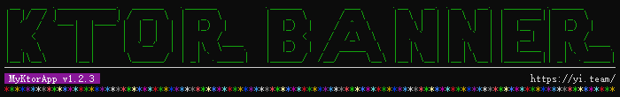
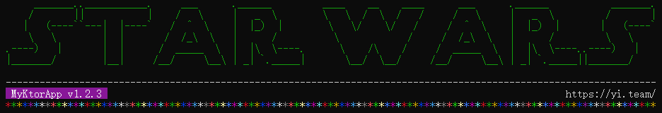

<div style="text-align: center;">



[![Build Status][10]][11]
[![GitHub release (latest by date)][20]][21]
[![Maven Central][30]][31]
[![Kotlin][70]][71]
[![Semantic Versioning 2.0.0][40]][41]
[![Conventional Commits][50]][51]
[![GitHub][60]][61]

</div>

# ktor-banner

Add a banner for ktor.

## Quick Start

```kotlin
fun main() {
    embeddedServer(Netty, port = 8000) {
        banner {
            bannerText = "Ktor Banner"
        }

        routing {
            get("/") {
                call.respondText("Hello, world!")
            }
        }
    }.start(wait = true)
}
```

This will print:

```text
  _  ___               ____                              
 | |/ / |_ ___  _ __  | __ )  __ _ _ __  _ __   ___ _ __ 
 | ' /| __/ _ \| '__| |  _ \ / _` | '_ \| '_ \ / _ \ '__|
 | . \| || (_) | |    | |_) | (_| | | | | | | |  __/ |   
 |_|\_\\__\___/|_|    |____/ \__,_|_| |_|_| |_|\___|_|   
                                                         
```

## Advanced usage

### Fully customizable

```kotlin
banner {
    bannerText = "Ktor Banner"

    // custom font
    loadFigFont = {
        val inputStream = ::main.javaClass.classLoader.getResourceAsStream("starwars.flf")

        FigFont.loadFigFont(inputStream)
    }

    // custom render
    render {
        println(it.text)
    }

    // append custom footer
    beforeBanner { banner ->
        println("".padEnd(banner.width, '-'))
    }

    // append custom footer
    afterBanner { banner ->
        val title = " MyKtorApp v1.2.3 "
        val homepage = "https://yi.team/"
        val filling = "".padEnd(banner.width - title.length - homepage.length, ' ')

        println("".padEnd(banner.width, '-'))
        println("$title$filling$homepage")
    }
}
```

This will print:

```text
-------------------------------------------------------------------------------------------------------------------
 __  ___ .___________.  ______   .______         .______        ___      .__   __. .__   __.  _______ .______      
|  |/  / |           | /  __  \  |   _  \        |   _  \      /   \     |  \ |  | |  \ |  | |   ____||   _  \     
|  '  /  `---|  |----`|  |  |  | |  |_)  |       |  |_)  |    /  ^  \    |   \|  | |   \|  | |  |__   |  |_)  |    
|    <       |  |     |  |  |  | |      /        |   _  <    /  /_\  \   |  . `  | |  . `  | |   __|  |      /     
|  .  \      |  |     |  `--'  | |  |\  \----.   |  |_)  |  /  _____  \  |  |\   | |  |\   | |  |____ |  |\  \----.
|__|\__\     |__|      \______/  | _| `._____|   |______/  /__/     \__\ |__| \__| |__| \__| |_______|| _| `._____|
                                                                                                                   
-------------------------------------------------------------------------------------------------------------------
 MyKtorApp v1.2.3                                                                                  https://yi.team/
```

### Colored

```kotlin
fun main() {
    embeddedServer(Netty, port = 8000) {
        banner {
            bannerText = "Ktor Banner"
        }

        routing {
            get("/") {
                call.respondText("Hello, world!")
            }
        }
    }.start(wait = true)
}
```

This will print:



## More fonts

see: http://www.figlet.org/

# Author

[@ymind][6], full stack engineer.

# License

This is open-sourced software licensed under the [MIT license][9].

[6]: https://github.com/ymind
[9]: https://opensource.org/licenses/MIT
[10]: https://github.com/ymind/ktor-banner/workflows/ktor-banner/badge.svg?branch=main
[11]: https://github.com/ymind/ktor-banner/actions
[20]: https://img.shields.io/github/v/release/ymind/ktor-banner
[21]: https://github.com/ymind/ktor-banner/releases
[30]: https://img.shields.io/maven-central/v/team.yi.rsql/ktor-banner
[31]: https://search.maven.org/artifact/team.yi.rsql/ktor-banner
[40]: https://img.shields.io/badge/Semantic%20Versioning-2.0.0-brightgreen
[41]: https://semver.org/
[50]: https://img.shields.io/badge/Conventional%20Commits-1.0.0-yellow.svg
[51]: https://conventionalcommits.org
[60]: https://img.shields.io/github/license/ymind/ktor-banner
[61]: https://github.com/ymind/ktor-banner/blob/main/LICENSE
[70]: https://img.shields.io/badge/kotlin-1.4.32-blue.svg?logo=kotlin
[71]: http://kotlinlang.org
